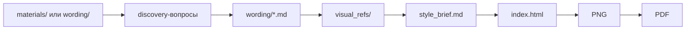

# Презентации с помощью LLM-агента

Это bootstrap-проект для создания бизнес-презентаций вместе с LLM-агентом.

Агент помогает пройти путь от **текста презентации (вординга)** и примеров стиля до готового `index.html` со слайдами. Затем слайды можно экспортировать в PNG и собрать в PDF.

[Скачать архив проекта (.zip)](https://github.com/idoziru/pitch-llm-agent/archive/refs/heads/main.zip) — скачайте и распакуйте у себя на компьютере.

## Как это работает



Если текст уже готов, этап `materials/` и discovery можно пропустить: положите текст в `wording/` и сразу попросите агента сделать презентацию.

## Какой агент подойдёт

Нужен LLM-агент, который умеет работать с файлами проекта: например OpenAI Codex, Claude, Cursor, Windsurf, Zed или OpenCode.

Выбирайте модель с поддержкой изображений. Без этого агент не сможет посмотреть примеры дизайна из `visual_refs/`.

## Быстрый старт

1. Подготовьте текст презентации:
   - если текст уже есть, положите его в `wording/`;
   - если текста нет, положите исходные материалы в `materials/` и попросите агента собрать вординг.
2. Положите 3-5 хороших визуальных референсов в `visual_refs/`.
3. Откройте папку проекта в LLM-агенте.
4. Если текста нет, напишите: `Помоги собрать вординг. Материалы лежат в materials/`.
5. Когда текст готов, напишите: `Сделай презентацию`.
6. После готовности попросите: `Запусти локальный сервер и дай ссылку для просмотра`.
7. В браузере нажмите `Export all slides as PNG`.
8. Соберите PNG в PDF любым удобным способом.

## Что положить в папки

`materials/` — исходные материалы, если агент должен сам собрать текст: отчёты, финмодели, исследования, брифы, таблицы, документы.

`wording/` — текст презентации. Лучше всего работает `.md`, где каждый слайд отделён строкой `---`.

`visual_refs/` — примеры визуального стиля. Без них агент не должен придумывать дизайн.

`imgs/` — готовые изображения для слайдов. Обычно добавляются позже, когда агент создаст список нужных картинок.

## Что считается хорошими visual_refs

Хорошие референсы помогают агенту понять не просто “красиво”, а какой стиль нужен для этой аудитории.

- 3-5 слайдов или страниц обычно достаточно для первого стиля.
- Лучше реальные бизнес-деки, лендинги продукта, investor decks или sales decks, чем случайные красивые картинки.
- Референсы должны быть близки по аудитории: инвесторы, C-level, клиенты, партнёры, внутренний совет директоров.
- Полезны примеры с похожей плотностью текста: если нужен reading deck, не кладите только минималистичные keynote-слайды.
- Покажите разные типы экранов: титул, слайд с тезисами, таблица/график, слайд с изображением.
- Не кладите референсы, стиль которых вам не нравится: агент будет использовать их как источник визуального языка.

## Рекомендуемый формат вординга

```markdown
# Слайд 1. Заголовок-вывод

Короткий текст слайда.

- Тезис 1
- Тезис 2

Комментарий по виду: слева текст, справа картинка.

---

# Слайд 2. Следующий заголовок-вывод

...
```

Если текста ещё нет, агент сначала задаст discovery-вопросы: аудитория, цель презентации, контекст показа, главный скепсис читателя и данные, которые можно использовать.

## Что сказать агенту

Если не знаете, с чего начать:

> Я не знаю, с чего начать. Помоги составить презентацию: задай вопросы и предложи план.

Если нужно собрать текст:

> Помоги собрать вординг. Материалы лежат в `materials/`.

Если текст уже готов:

> Сделай презентацию из текста в `wording/` и референсов в `visual_refs/`.

Если нужно посмотреть результат:

> Запусти локальный сервер и дай ссылку для просмотра.

Если что-то сломалось:

> Экспорт PNG не работает — разберись и почини.

## Важные правила

- Агент не должен выдумывать данные, цифры и источники.
- Если данных не хватает, агент должен пометить это как `TBD`, `source required` или `requires validation`.
- Агент не должен менять готовый пользовательский текст и факты без разрешения.
- Дизайн берётся из `visual_refs/`, а не из вкуса агента.
- Слайды фиксированы: 1280x720 px.

## Как получить PDF

1. Запустите локальный сервер через агента или командой `python3 scripts/serve.py`.
2. Откройте `http://localhost:8000/index.html`.
3. Нажмите `Export all slides as PNG`.
4. Соберите PNG в PDF через Preview на macOS, системную печать в PDF или онлайн-сервис.

## Подробная документация

Расширенные правила для агентов, `style_brief.md`, `image_manifest.json`, export checklist и troubleshooting вынесены в [docs/advanced.md](docs/advanced.md).

Основные правила для агента лежат в [AGENTS.md](AGENTS.md), детальные skills — в папке [skills/](skills/).

## Лицензия

[MIT](LICENSE) — можно использовать как угодно.
