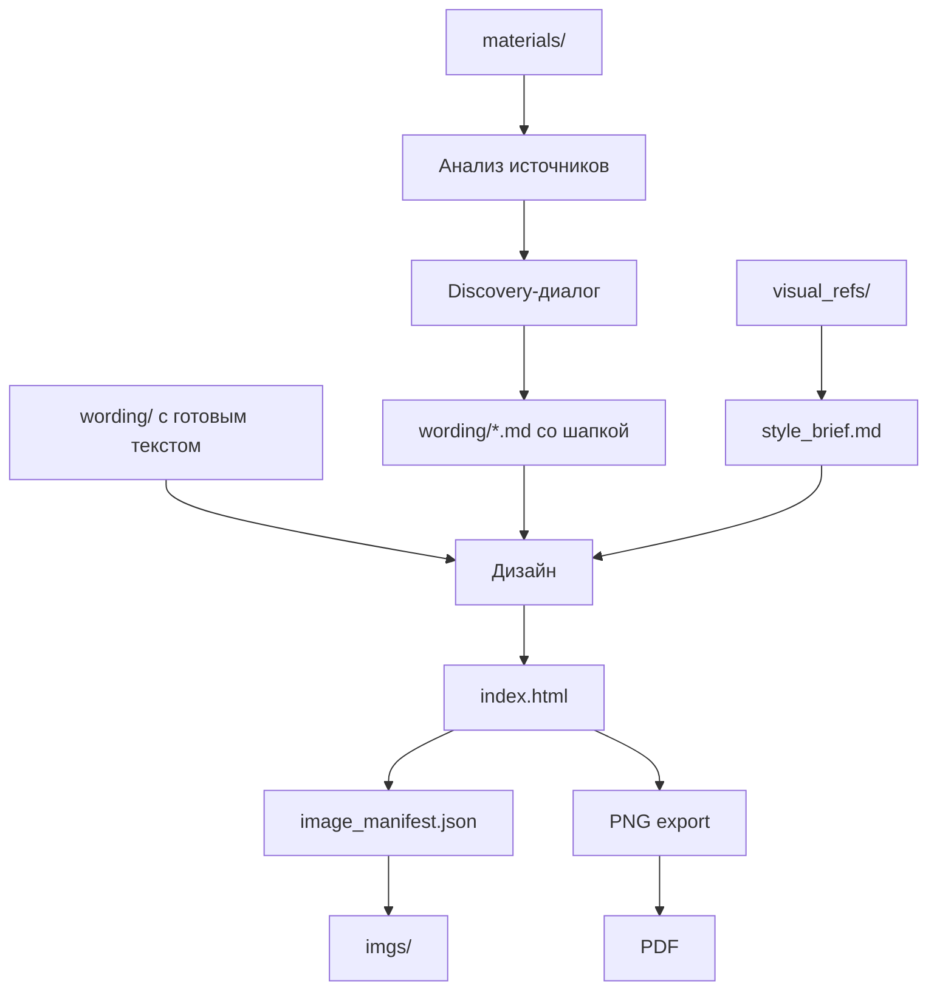

# Advanced usage

Этот документ нужен тем, кто хочет понимать внутренний workflow проекта или дорабатывать правила для агента.

Пользовательский маршрут описан в [README.md](../README.md). Операционные инструкции для агента — в [AGENTS.md](../AGENTS.md). Детальные правила лежат в [skills/](../skills/).

## Роли файлов

`wording/*.md` — источник текста презентации. Если агент создаёт вординг сам, файл должен начинаться с discovery-шапки: аудитория, цель, контекст показа, скепсис, главный тезис, proof map, source register и data inventory.

`style_brief.md` — рабочее описание визуального стиля. Создаётся только на основе `visual_refs/`; не должен выдумывать стиль из воздуха.

`image_manifest.json` — единый список visual slots: где нужна картинка, какой filename ожидает `index.html`, какой prompt использовать, найден ли файл в `imgs/`.

`index.html` — готовая презентация: один HTML-файл без сборки и Node.js.

## Process map



## Discovery-шаблон

Основной шаблон находится в [skills/pitch-wording.md](../skills/pitch-wording.md). Агент использует его перед созданием вординга, если в `wording/` ещё нет готового текста.

Минимум, который нужен для старта:

- аудитория и роль ЛПР;
- цель презентации и ожидаемое решение;
- контекст показа: reading deck или presentation deck;
- главный скепсис ЛПР;
- какую картину мира укрепляем или меняем;
- что читатель уже знает;
- ограничения по конфиденциальности и источникам.

Если ответов нет, агент должен остановиться или явно пометить допущения как `requires confirmation`.

## image_manifest.json

Каждый visual slot должен иметь запись:

```json
{
  "slide": 2,
  "slot": "right_visual",
  "filename": "slide-02-customer-problem-map.png",
  "description_ru": "Схема пользовательской проблемы",
  "aspect_ratio": "4:3",
  "size": "560x420",
  "prompt_hint_ru": "Подробное описание изображения для генерации",
  "status": "placeholder"
}
```

Правила:

- `filename` должен точно совпадать с тем, что ожидает `index.html`;
- prompt пишется на русском и опирается на `style_brief.md`;
- существующие записи не удаляются без явной причины;
- если файл уже есть в `imgs/`, статус обновляется на `found`;
- если картинки нет, статус остаётся `placeholder`.

## Export readiness

Перед тем как считать `index.html` готовым к PNG export, агент проверяет:

- каждый `.slide` имеет размер `1280x720px`;
- структура слайда: `.slide-header`, `.slide-body`, `.slide-footer`;
- `.slide-body` имеет `flex: 1; min-height: 0; overflow: hidden;`;
- header height `44px`, footer height `40px`;
- header/footer имеют `flex-shrink: 0`;
- вложенные grid/flex-контейнеры имеют `min-height: 0`;
- видимые элементы сохраняют цвета через `print-color-adjust: exact`;
- изображения имеют `display: block` и `object-fit: contain`;
- нет inline-стилей с CSS variables для значений, которые должен увидеть html2canvas.

## Локальный сервер

Запуск:

```bash
python3 scripts/serve.py
```

Если порт 8000 занят, скрипт больше не убивает процесс автоматически. Он покажет PID и спросит подтверждение. Если ответить `n`, сервер не стартует и подскажет, как освободить порт вручную.

## Troubleshooting

**PNG export пустой или сломан** — чаще всего `index.html` открыт напрямую через `file://`, а не через локальный сервер. Запустите `python3 scripts/serve.py`.

**Footer уехал или текст вылез за слайд** — проверьте `min-height: 0` на `.slide-body` и вложенных flex/grid-контейнерах.

**Картинка не подставилась** — имя файла в `imgs/` должно полностью совпадать с `filename` из `image_manifest.json`.

**Агент начал придумывать стиль** — добавьте реальные `visual_refs/`; без них дизайн должен быть заблокирован.

**Агент начал придумывать цифры** — попросите пометить недостающие данные как `source required`, `TBD` или `requires validation`.

## Встроенные skills

- `collaboration.md` — как агент работает как напарник.
- `research-sources.md` — поиск и источники, только по просьбе пользователя.
- `pitch-wording.md` — вординг, discovery, proof map, source register.
- `pitch-wording-gamedev.md` — доменные правила для геймдева.
- `html-structure.md` — структура `index.html` и placeholders.
- `slide-layout-safety.md` — геометрия слайда и overflow.
- `png-export-safety.md` — PNG export и html2canvas.
- `image-manifest-prompts.md` — visual slots и prompt hints.
